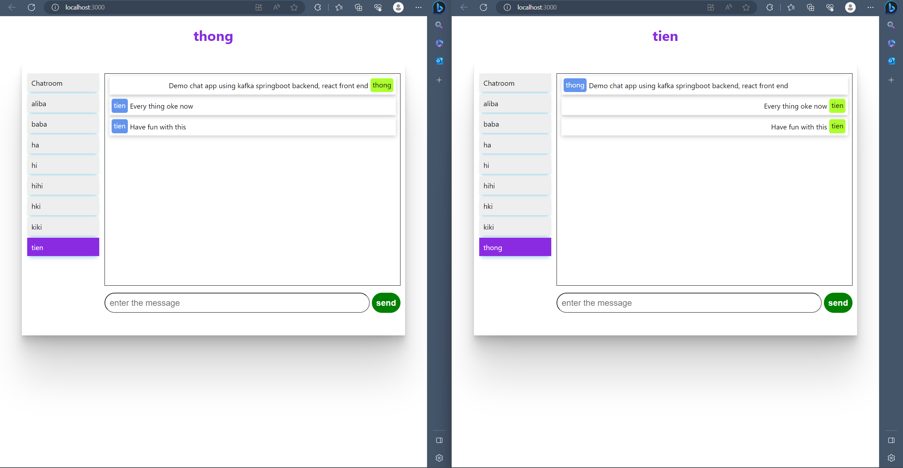

# WebApp Chat with Kafka and React
This project is a web application that allows users to engage in real-time chat conversations using Kafka as the messaging system and React for the front-end development. The application provides a seamless and interactive chat experience with the help of Kafka's publish-subscribe messaging model.

#### Setup and Installation
To set up the project locally, follow these steps:


## Demo




## Installation

To install and set up the project, please follow the steps below:

Clone the repository: git clone https://github.com/kidhood/chat-app-kafka-springboot-react.git

Navigate to the React client directory:


```bash
cd react-client
npm install
npm start
```

Please note that you need to have Apache Kafka installed on your system. If you haven't already, download Apache Kafka from the official website: https://kafka.apache.org/

After downloading Kafka, follow these steps to start the ZooKeeper and Kafka broker services:

```bash
# Start the ZooKeeper service
.\bin\windows\zookeeper-server-start.bat .\config\zookeeper.properties

# Start the Kafka broker service
.\bin\windows\kafka-server-start.bat .\config\server.properties

```

Next, make the following modification to the configuration file in the Spring Boot project:

```bash
spring:
  datasource:
    url: jdbc:mysql://localhost:3306/chat-app
    username: <write user name here>
    password: <password>
    driver-class-name: com.mysql.cj.jdbc.Driver
  jpa:
    hibernate.ddl-auto: update
    generate-ddl: true
    hibernate:
      ddl-auto: update
    #    show-sql: true
    properties:
      hibernate:
        dialect: org.hibernate.dialect.MySQL8Dialect
        format_sql: true
  kafka:
    consumer:
      auto-offset-reset: earliest

```

Make sure to replace <write user name here> with your MySQL database username and <password> with your corresponding password.


    
## Features

- Real-time messaging: Users can exchange messages in real-time with other participants in the chat.
- Multiple chat rooms: The application supports multiple chat rooms, allowing users to join and participate in different conversations.
- Message history: Chat messages are persisted and can be retrieved, allowing users to view previous conversations.

## Technologies Used

- Apache Kafka: An open-source distributed event streaming platform used as the messaging system for real-time chat functionality.
- React: A JavaScript library for building user interfaces, utilized for developing the front-end components and managing the user interface interactions.
-Spring Boot: building backend
